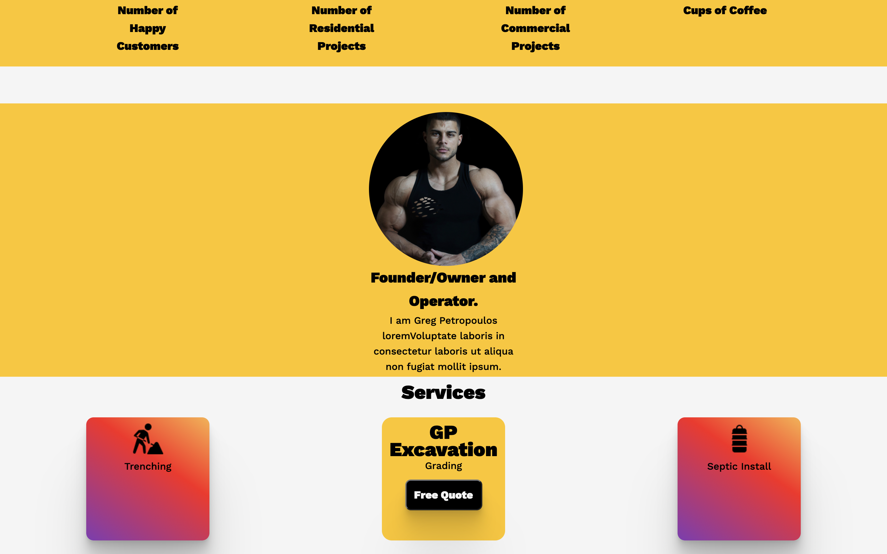
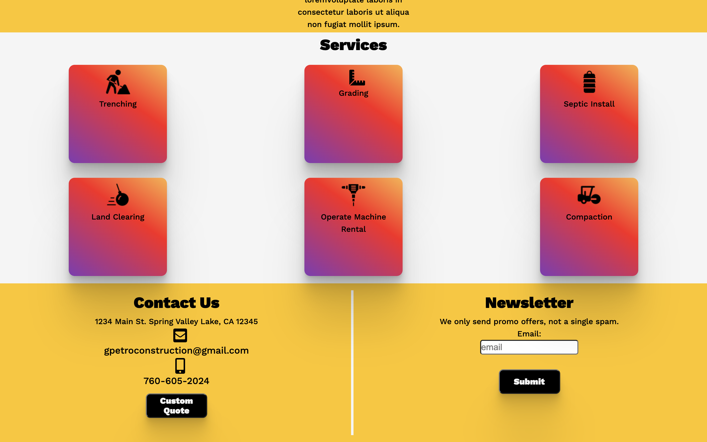
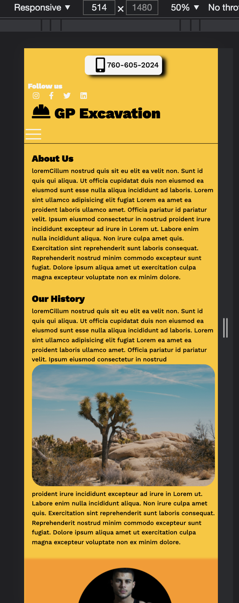
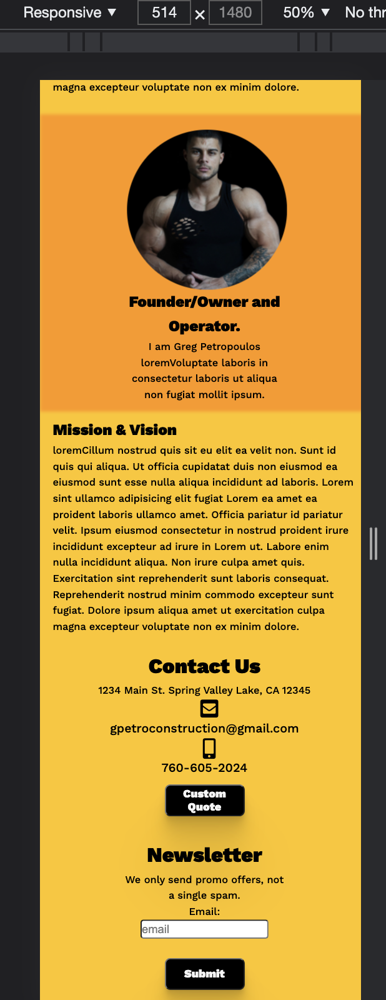
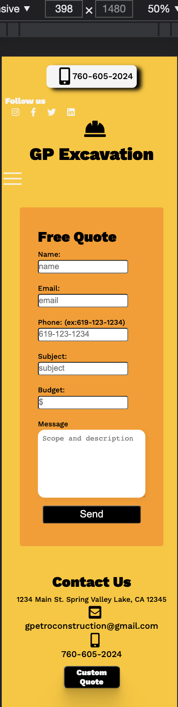

# GP-Excavation
[Deployed Link](https://gpexcavation.herokuapp.com/)

Building out an client website for excavation business, Client was using a temp wix website.

The new website is fully functional and ready for deployment. Utilized the Email.js dependencies and protected keys needed for the access to Email.js, rather than build a backend for simple emails and forms for quotes.

 Styling and functions I utilized framer-motion, spring, react-bootstrap, react-router and styled-components to include media querys for mobile responsiveness. The state is managed by the useState hooks. 

See images below for most recent updates
## Main Page

## Main Page

## Main Page

## Main Page

## Mobile About Section

## Mobile About Section

## Mobile Contact Section

# .....More to come

